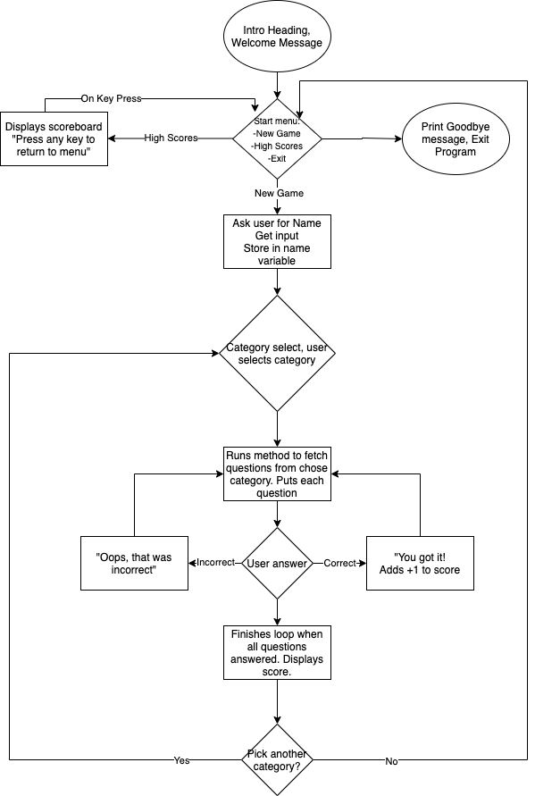

# Ruby Trivia Game

## Repository Link
[Github Repository](https://github.com/Theosaurus-Rex/trivia-app)

## Software Development Plan

### Purpose & Scope
*Terminal Trivia* is a CLI trivia game that tests players' knowledge in a series of multiple choice questions. It aims to be simple to use and interact with, and provide entertainment for those who want a fun single-player game where the questions are randomized each time to avoid repetition. 
This game is aimed at ages 13+ due to the large amount of reading required. The application can be launched by running the `install-and-run.sh` file in the "src" folder.

### Features
- **Categories:** Ten different themed categories for you to pick from! 
- **Scoring System:** Record your scores with your name and category on the scoreboard to test yourself against your friends
- **Intuitive Interface:** This app utilises *TTY-Prompt* to enable input selection with the arrow keys, so there's no need to type your answer selection!

### Installation & Use
To install and run, download the provided files and run `install-and-run.sh` to play!
Please note that this app may not function as intended in bash terminals due to the reliance on tty-prompt for answer selection.

Users can use the command `-h` or `--h` to display a help menu for how to use the game.

Users will be asked to enter their name when starting a new game so that their score can be recorded to the scoreboard. The scoreboard can be accessed from the Start menu under the option 'Score Board'. 

When answering questions or selecting a category, users can choose their input using the arrow keys on their keyboard. When this is an option, a text prompt will display to indicate how to interact with the various menus in-game.

Due to the nature of the arrow-select interface, user input errors are minimised. In cases where errors do occur, a text prompt will display explaining the nature of the error to the user.

### Control Flow Diagram

## Implementation Plan

### Questions, Answers and Categories
All questions, answers, and categories are generated from the [Open Trivia Database](https://opentdb.com/api_config.php) API. This is a free API where users can contribute questions freely, that are then approved and added. This means that the game will always have new questions to answer!
Decoding is implemented using a custom module within the source code to replace HTML entities with the correct characters to ensure readability of question and answer content.

**Checklist:**
- API Integration (Priority: High)
- Implementation of different categories (Priority: Medium)
- Separating questions and answers for each piece of question data recieved (Priority: High)
- Testing for encrypted output (Priority: Medium)
- Decoding encrypted output (Priority: High)
- Time permitting, add difficulty modes (Priority: Low)

### Score System
To maintain consistency, the scoreboard will be stored in an external file that will be read and written to by the Trivia application. The scoreboard will contain the Player name, the category they picked, and their score for that category. The most recent score will be placed at the bottom of the list each time.

**Checklist:**
- Create document for score board storage (Priority: High)
- Implement method to get player name input (Priority: Medium)
- Implement method to add to player score when correct answer is selected (Priority: High)
- Implement method to write score to score board (Priority: High)
- Implement method to read score board and display to terminal when Scores option selected from Start Menu (Priority: Medium)
- Time permitting, style score board output using coloured text to differentiate sections (Priority: Low)
- Add method to clear scoreboard (Priority: Low)

### User Interface
The trivia application will utilise the Ruby Gem [TTY-Prompt](https://ttytoolkit.org/) to make interfacing as smooth and hassle-free as possible for the player. This gem will allow players to use their arrow keys to select answers instead of manually typing in their selection.

**Checklist:**
- Integrate TTY-Prompt into application (Priority: Medium)
- Add arrays for prompt selection on start menu and category select menu (Priority: Meidum)
- Create method for TTY Shell Command `--help`(Priority: Low)
- Obtain user testing feedback on system interfacing (Priority: Low)
- Test that interfacing works on question selection for each quiz category (Priority: High)

## Testing
Testing for this app was conducted manually. Outcomes of testing and relevant revisions can be found [HERE](https://docs.google.com/spreadsheets/d/1QCGglflX-MNKs5fcIwE3dFARk7FxPZGeSLgFV54L5HU/edit?usp=sharing)

